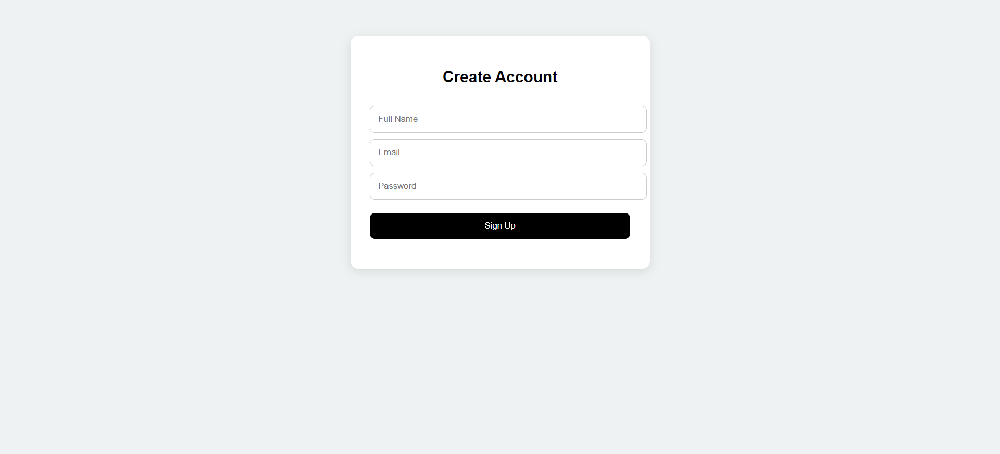
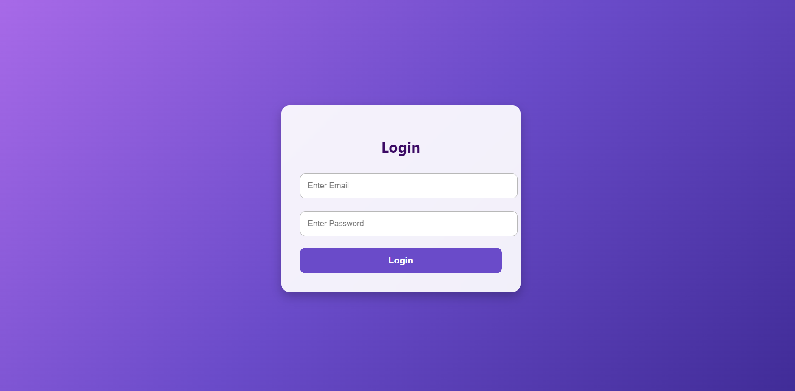
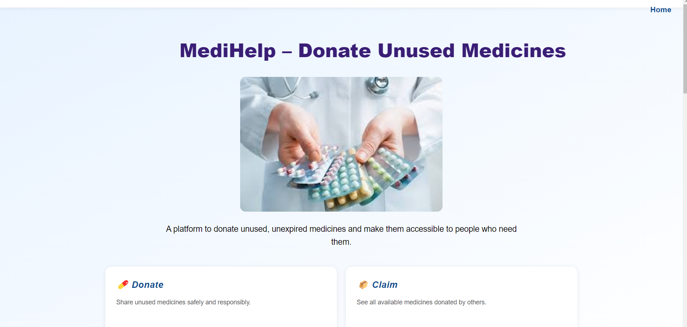
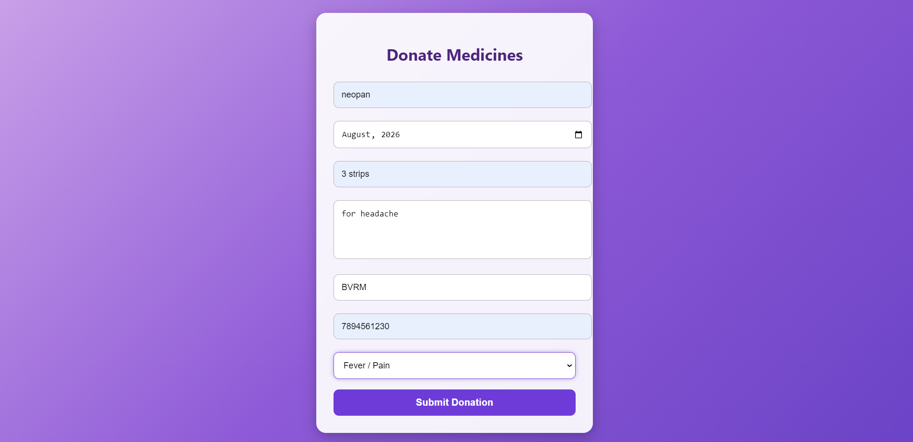
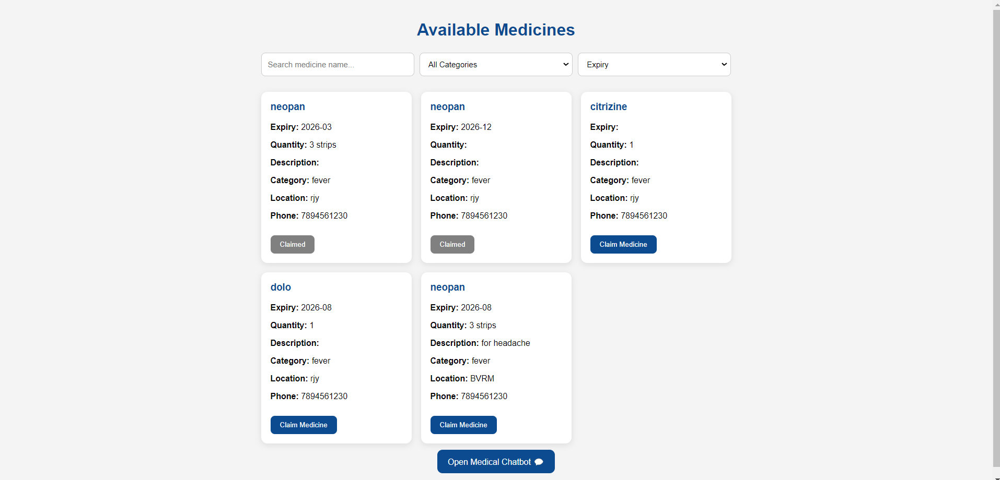
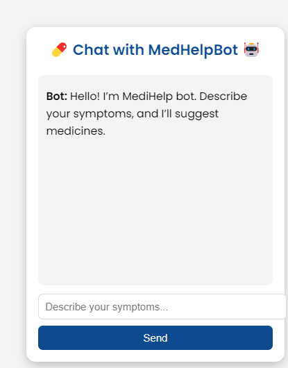

🩺 **MEDIHELP – Medicine Management**  
Helping you manage medicines and get guidance quickly! 💊🤖

📑 **Table of Contents**
- [About the Project](#about-the-project)  
- [Features](#features)  
- [Demo](#demo)  
- [Technologies Used](#technologies-used)  
- [Installation](#installation)  
- [Usage](#usage)  
- [Screenshots](#screenshots)  
- [Future Improvements](#future-improvements)  
- [License](#license)  

## 📖 About the Project
**MEDIHELP** is a web-based platform designed to help users manage medicines efficiently and get guidance through a simple chatbot.  

Users can:  
- View and search medicine lists  
- Donate medicines   
- Claim medicines  
- Interact with a chatbot for basic medical assistance   

## ✨ Features
💊 **Medicine List:** View, search, and manage medicines   
📝 **Medicine Details:** Check details of any medicine  
🤝 **Donate Medicines:** Contribute medicines to users in need 
🎁 **Claim Medicines:** Claim medicines from available donations  
🤖 **Chatbot Assistance:** For basic information  
🔒 **Secure Backend:** Sensitive info stored in `.env`  
🗄️ **MongoDB Storage:** Data persists across sessions  

## 🎥 Demo
[demo-video](https://github.com/user-attachments/assets/e2e41d50-ee1d-448a-97ef-979fbec4c91b)

📌**Note:** The demo video is ~1 minute long. For faster viewing and better understanding, you may adjust the playback speed (e.g., 1.25x / 1.5x).

## 🛠️ Technologies Used 
- **Frontend:** HTML, CSS, JavaScript   
- **Backend:** python with flask   
- **Database:** MongoDB   
- **Tools:** VSCode, Git, GitHub   

## ⚙️ Installation
To run this project locally: 
***1. Clone the repository*** 
git clone (https://github.com/hemasriaavala/MediHelp.git) 
cd MEDIHELP 
***2. Setup Backend*** 
cd medhelp-backend 
npm install       # Install dependencies 
***3. Configure Environment Variables*** 
Create a .env file inside medhelp-backend/ with the following variables: 
PORT=3000 
MONGO_URI=your_mongodb_connection_string 
Important: Do not share .env publicly; it contains sensitive data. 
***4. Start Backend*** 
node server.js 
***5. Open Frontend*** 
Open the HTML files in frontend/ using a browser (or serve via Live Server). 

## 🚀 Usage 
- Open the frontend files in your browser (or use Live Server in VSCode). 
- View full details of any medicine. 📝  
- Donate medicines to others in need. 🤝  
- Claim medicines from available donations. 🎁    
- Interact with the chatbot for guidance. 🤖

## 📝 Notes 
- .env is required to run the backend; backend will not work without proper MongoDB URI 
- node_modules/ is ignored; run npm install to install packages locally 
- IDE folders like .vscode/ and .vs/ are ignored—they are not required for the project 
- Only track essential files: frontend files, server.js, package.json, package-lock.json

## 📸 Screenshots  
**Main Page**  

**Signup**  

**Login**  

**Modules-page** 

**Donate-Medicine** 

**Claim-Medicine** 

**Mini chatbot** 

## 🔮 Future Improvements 
Enhance chatbot with AI-based guidance 
Add admin panel to manage medicines more efficiently

## 📝 MIT License 
Copyright (c) 2026 Aavala Hema Sri 
Permission is hereby granted, free of charge, to any person obtaining a copy 
...
